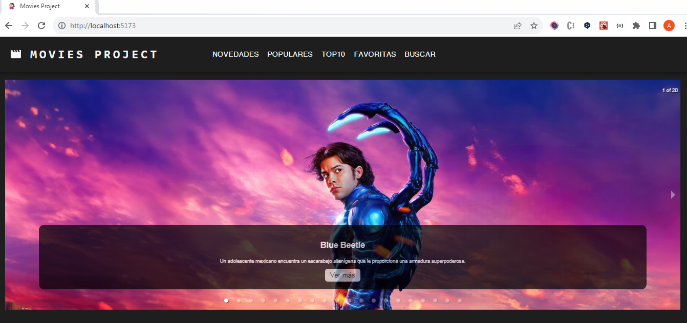
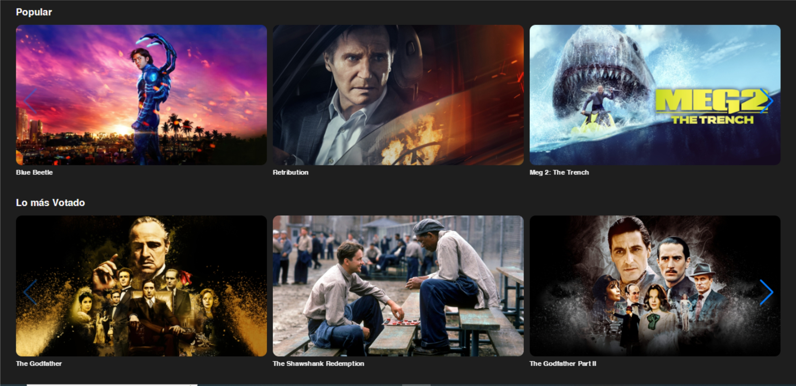
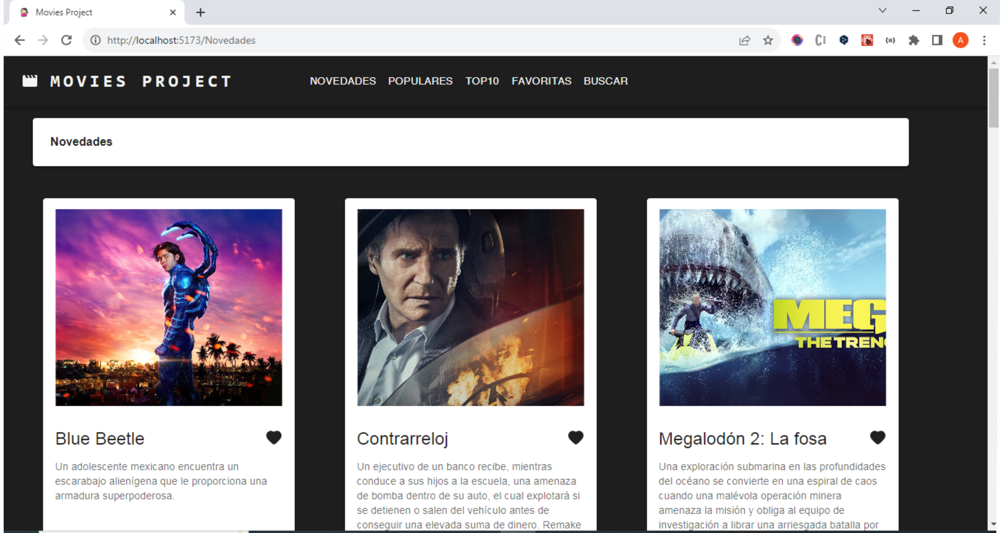
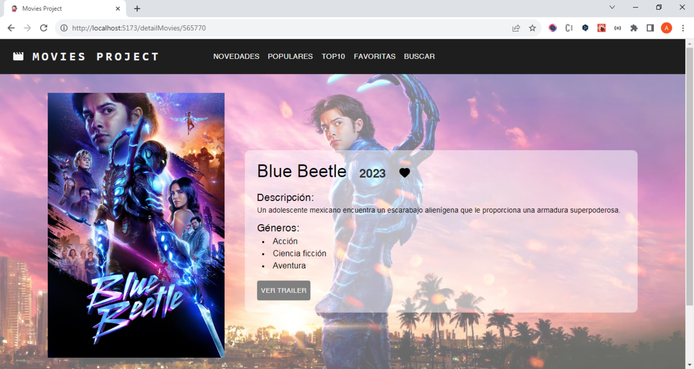

# React + Vite + MUI 

## The Movies Project
# Películas TMDB App
[link del repo](https://github.com/Ana-Laura-Flores/moviesProject)

[link del deploy](https://ana-laura-flores.github.io/ahorradas-proyect-javascript/)

Este proyecto es una aplicación web que muestra información sobre películas utilizando la API de The Movie Database (TMDB). La aplicación está construida con React, Vite y Material-UI, Swiper, utiliza localStorage.

## Características

- Búsqueda de películas por título.
- Visualización de detalles de películas.
- Listado de películas populares, más votadas y novedades.
- Podés añadir y quitar películas favoritas.
- Diseño atractivo y amigable para el usuario gracias a Material-UI.

Carrusel de imágenes

Contenedor de las cards Movies

Detalle de las películas

